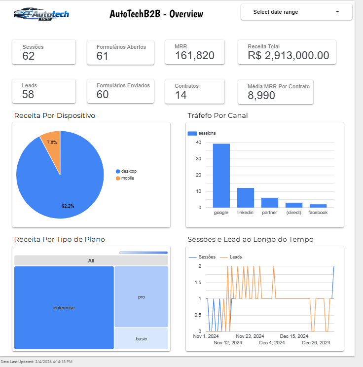
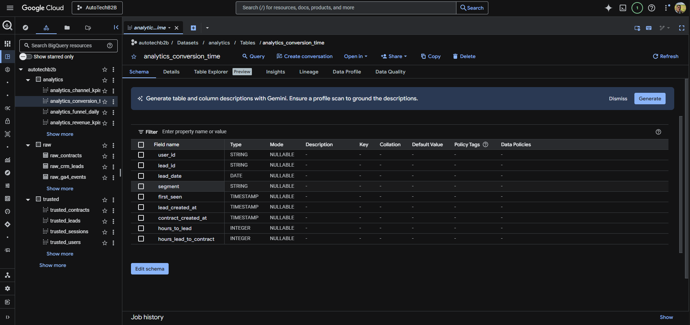

# AutoTech B2B — Analytics com GA4 & GCP (BigQuery)

[](LICENSE)

**Projeto de portfólio** que demonstra um pipeline completo de dados analíticos para cenário B2B AutoTech: funil **Web/App → Lead → Demo → Contrato**, com stack **Google Analytics 4**, **Google Cloud (BigQuery)** e **Looker Studio**. Utiliza dados sintéticos executáveis por qualquer pessoa com projeto GCP, sem dependência de propriedade GA4 real — ideal para portfólio de **Analista de Dados / Analytics** com foco em GA4 e BigQuery.

---

## Conteúdo do repositório

- [Visão geral](#visão-geral-do-projeto)
- [O que foi entregue](#o-que-foi-entregue)
- [Screenshots do projeto](#screenshots-do-projeto)
- [Stack e arquitetura](#stack-e-arquitetura)
- [Como executar](#como-executar)
- [Estrutura do projeto](#estrutura-do-repositório)
- [Documentação](#documentação)
- [Subir no GitHub](#subir-no-github)

---

## Visão geral do projeto

O repositório modela um fluxo de analytics para uma empresa **AutoTech B2B** que vende soluções para **frotas**, **concessionárias** e **seguradoras**. O objetivo é unificar eventos web (GA4), leads (CRM) e contratos em um único ambiente analítico no BigQuery, com camadas **raw → trusted → analytics**, e responder perguntas de negócio sobre funil, canais, receita e tempo até conversão.

### Problema de negócio

- Falta de visibilidade unificada entre tráfego (GA4), leads (CRM) e contratos (vendas).
- Necessidade de atribuição de conversões a canais (ex.: last non-direct) e tempo até conversão por canal/segmento.
- Exigência de qualidade de dados e governança para decisões baseadas em dados.

### Objetivos

- **Unificar** eventos web (mock GA4), leads (CRM) e contratos em um único ambiente analítico (BigQuery).
- **Modelar** camadas raw, trusted e analytics com SQL e boas práticas.
- **Calcular** funil (sessões → lead → demo → contrato), performance de canais, atribuição simplificada e time-to-convert.
- **Documentar** plano de mensuração GA4, taxonomia, checklist GTM/GA4 e arquitetura.

---

## O que foi entregue

Resumo do que está implementado e documentado neste repositório.

| Etapa | Entregável | Descrição |
|-------|------------|-----------|
| **Dados** | 3 CSVs sintéticos | `ga4_events_mock.csv`, `crm_leads.csv`, `contracts.csv` — dados consistentes (user_id, lead_id) para funil e receita |
| **BigQuery** | 3 datasets | `raw`, `trusted`, `analytics` — camadas separadas |
| **SQL** | 9 scripts | Criação de datasets/tabelas raw, views trusted e analytics, análises (funil, canais, atribuição, time-to-convert), data quality checks |
| **ETL** | Script Python | Carregamento dos CSVs para BigQuery com config YAML, validação e modo `--dry-run` |
| **Dashboard** | Looker Studio | Overview com 8 KPIs (funil + receita), gráficos: receita por dispositivo, tráfego por canal, receita por plano, sessões/leads no tempo; filtro de data |
| **Documentação** | 9 docs + guias | Contexto de negócio, plano GA4, taxonomia, checklist GTM/GA4, arquitetura GCP, modelagem, dicionário de dados, KPIs, roadmap, passo a passo do dashboard e perguntas de negócio |

O dashboard final foca em **uma página Overview** com os principais KPIs e gráficos; a documentação inclui 12 perguntas de negócio com passo a passo para expansão (páginas Funil, Canais, Tempo até conversão).

---

## Screenshots do projeto

Alguns registros do que foi implementado.

### Dashboard (Looker Studio)



*Overview com KPIs (funil + receita) e gráficos: receita por dispositivo, tráfego por canal, receita por plano, sessões e leads no tempo.*

### BigQuery — Datasets e camadas



*Datasets raw, trusted e analytics no console BigQuery.*

### ETL — Carregamento dos dados

*(Opcional: adicione `screenshots/etl-terminal.png` com a saída do `python load_to_bigquery.py`.)*

### BigQuery — Consultas (opcional)

*(Opcional: adicione `screenshots/bigquery-editor.png` com um print do editor de consultas.)*

---

## Stack e arquitetura

### Stack

| Componente | Tecnologia |
|------------|------------|
| Dados sintéticos | CSV (GA4 events, CRM leads, contratos) |
| Armazenamento | Google BigQuery |
| ETL | Python (pandas, google-cloud-bigquery, PyYAML) |
| Configuração | YAML |
| Visualização | Looker Studio |
| Documentação | Markdown |

### Arquitetura de dados

```
┌─────────────────────────────────────────────────────────────────┐
│  GA4 (mock CSV) + CRM (leads CSV) + Contracts (CSV)             │
└─────────────────────────────────────────────────────────────────┘
                                │
                                ▼
┌─────────────────────────────────────────────────────────────────┐
│                    BigQuery — RAW                                │
│  raw_ga4_events | raw_crm_leads | raw_contracts                 │
└─────────────────────────────────────────────────────────────────┘
                                │
                                ▼
┌─────────────────────────────────────────────────────────────────┐
│                    BigQuery — TRUSTED                            │
│  trusted_sessions | trusted_users | trusted_leads | trusted_*    │
└─────────────────────────────────────────────────────────────────┘
                                │
                                ▼
┌─────────────────────────────────────────────────────────────────┐
│                    BigQuery — ANALYTICS                          │
│  analytics_funnel_daily | analytics_channel_kpis | ...           │
└─────────────────────────────────────────────────────────────────┘
                                │
                                ▼
┌─────────────────────────────────────────────────────────────────┐
│                      Looker Studio                               │
│  Dashboard Overview (KPIs + gráficos)                           │
└─────────────────────────────────────────────────────────────────┘
```

### Camadas no BigQuery

| Camada | Objetivo | Conteúdo principal |
|--------|----------|--------------------|
| **raw** | Ingestão sem transformação | Tabelas espelho dos CSVs |
| **trusted** | Limpeza e modelagem | Views de sessões, usuários, leads, contratos |
| **analytics** | Métricas para relatórios | Funnel diário, KPIs por canal, tempo até conversão, receita |

---

## Como executar

### Pré-requisitos

- Conta **Google Cloud** com **BigQuery API** ativada
- **Python 3.9+** e `pip`
- Autenticação: `gcloud auth application-default login` ou Service Account (variável `GOOGLE_APPLICATION_CREDENTIALS`)

### Passos (resumo)

1. **Criar datasets no BigQuery** — `sql/00_create_datasets.sql` (instruções no arquivo).
2. **Criar tabelas raw** — Executar `sql/01_create_tables_raw.sql` no BigQuery (substitua `autotechb2b` pelo seu project_id se necessário).
3. **Views trusted e analytics** — Executar `sql/02_trusted_views.sql` e `sql/03_analytics_models.sql`.
4. **ETL** — Copiar `etl/config.example.yaml` para `etl/config.yaml`, preencher `project_id` e caminhos dos CSVs; rodar `python load_to_bigquery.py` na pasta `etl`.
5. **Análises (opcional)** — Executar `sql/04` a `08` para funil, canais, atribuição, tempo até conversão e data quality.
6. **Looker Studio** — Conectar ao BigQuery (dataset `analytics` e, se desejar, `trusted`); criar relatório usando as views analytics.

Guia detalhado passo a passo: [docs/PASSO_A_PASSO.md](docs/PASSO_A_PASSO.md).  
ETL: [etl/README_ETL.md](etl/README_ETL.md).  
Dashboard: [dashboards/README_DASHBOARD.md](dashboards/README_DASHBOARD.md).

---

## Estrutura do repositório

```
autotech-ga4-gcp-analytics/
├── README.md                 # Este arquivo
├── LICENSE
├── .gitignore
├── requirements.txt
├── screenshots/              # Prints para o README (dashboard, BigQuery, ETL)
├── data/                     # CSVs sintéticos
│   ├── ga4_events_mock.csv
│   ├── crm_leads.csv
│   └── contracts.csv
├── sql/                      # Scripts BigQuery
│   ├── 00_create_datasets.sql
│   ├── 01_create_tables_raw.sql
│   ├── 02_trusted_views.sql
│   ├── 03_analytics_models.sql
│   ├── 04_funnel_analysis.sql
│   ├── 05_channel_performance.sql
│   ├── 06_attribution_last_nondirect.sql
│   ├── 07_time_to_convert.sql
│   └── 08_data_quality_checks.sql
├── etl/
│   ├── README_ETL.md
│   ├── load_to_bigquery.py
│   ├── config.example.yaml   # Copiar para config.yaml (não versionado)
│   └── config.yaml           # Local apenas; não commitar
├── dashboards/
│   ├── README_DASHBOARD.md
│   ├── PASSO_A_PASSO_12_PERGUNTAS.md
│   ├── PASSO_A_PASSO_OVERVIEW_1.md
│   └── screenshots/          # Screenshots do dashboard (opcional)
└── docs/
    ├── PASSO_A_PASSO.md
    ├── 01_contexto_negocio.md
    ├── 02_plano_mensuracao_ga4.md
    ├── 03_taxonomia_eventos_parametros.md
    ├── 04_checklist_gtm_ga4_qa.md
    ├── 05_arquitetura_gcp_bigquery.md
    ├── 06_modelagem_dados.md
    ├── 07_dicionario_dados.md
    ├── 08_kpis_metricas.md
    ├── 09_roadmap_melhorias.md
    └── DASHBOARD_PERGUNTAS_E_GRAFICOS.md
```

---

## Documentação

| Documento | Conteúdo |
|-----------|----------|
| [docs/01_contexto_negocio.md](docs/01_contexto_negocio.md) | Cenário AutoTech B2B, problema e objetivos |
| [docs/02_plano_mensuracao_ga4.md](docs/02_plano_mensuracao_ga4.md) | Plano de mensuração GA4 (eventos, parâmetros) |
| [docs/03_taxonomia_eventos_parametros.md](docs/03_taxonomia_eventos_parametros.md) | Naming convention e exemplos |
| [docs/04_checklist_gtm_ga4_qa.md](docs/04_checklist_gtm_ga4_qa.md) | Checklist de auditoria GTM/GA4 |
| [docs/05_arquitetura_gcp_bigquery.md](docs/05_arquitetura_gcp_bigquery.md) | Arquitetura GCP, datasets, custos |
| [docs/06_modelagem_dados.md](docs/06_modelagem_dados.md) | Camadas raw/trusted/analytics |
| [docs/07_dicionario_dados.md](docs/07_dicionario_dados.md) | Dicionário das colunas principais |
| [docs/08_kpis_metricas.md](docs/08_kpis_metricas.md) | Definição de KPIs (CAC, LTV, ROI simulados) |
| [docs/09_roadmap_melhorias.md](docs/09_roadmap_melhorias.md) | Próximos passos (GA4 real, dbt, monitoramento) |
| [docs/DASHBOARD_PERGUNTAS_E_GRAFICOS.md](docs/DASHBOARD_PERGUNTAS_E_GRAFICOS.md) | 12 perguntas de negócio e gráficos |
| [docs/PASSO_A_PASSO.md](docs/PASSO_A_PASSO.md) | Guia de execução do projeto (GCP → ETL → Looker) |

---

## Data Quality e governança

- **SQL:** [sql/08_data_quality_checks.sql](sql/08_data_quality_checks.sql) — checagem de duplicidade, nulos, integridade lead_id, faixas de receita e consistência temporal.
- **ETL:** Validação de contagem de linhas, logs e modo `--dry-run`.
- **Documentação:** Dicionário de dados, modelagem e checklist GTM/GA4 para governança.

---

## Subir no GitHub

Para criar o repositório no GitHub e enviar este projeto:

1. **Crie um repositório novo** no GitHub (github.com → New repository). Nome sugerido: `autotech-ga4-gcp-analytics` ou `AutoTechB2B-Analytics`. Deixe sem README, .gitignore ou license (você já tem no projeto).
2. **No terminal, na pasta do projeto:**

   ```bash
   cd C:\Users\dopamine\Desktop\Projetos\AutoTechB2B
   git init
   git add .
   git status   # Confira: config.yaml NÃO deve aparecer (está no .gitignore)
   git commit -m "feat: projeto completo AutoTech B2B Analytics - GA4, BigQuery, Looker Studio"
   git branch -M main
   git remote add origin https://github.com/Gleidisonjr/autotech-ga4-gcp-analytics.git
   git push -u origin main
   ```

   Se usar outro usuário, troque `Gleidisonjr` na URL. Se o repositório for privado, o GitHub pode pedir autenticação (token ou SSH).

3. **Não commite** `etl/config.yaml` (contém seu `project_id`; já está no `.gitignore`). O `config.example.yaml` é versionado como modelo.

Guia detalhado: [GITHUB_UPLOAD.md](GITHUB_UPLOAD.md).

---

## Licença

MIT — ver [LICENSE](LICENSE).

---

*Projeto de portfólio — Analista de Dados / Analytics (GA4 & GCP).*
